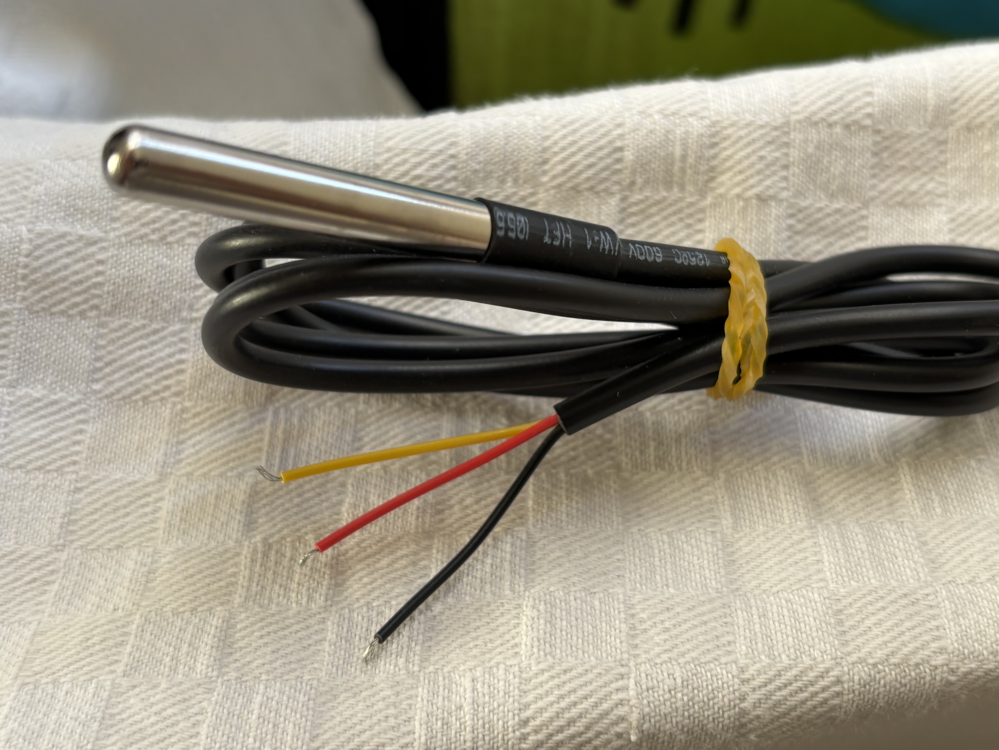
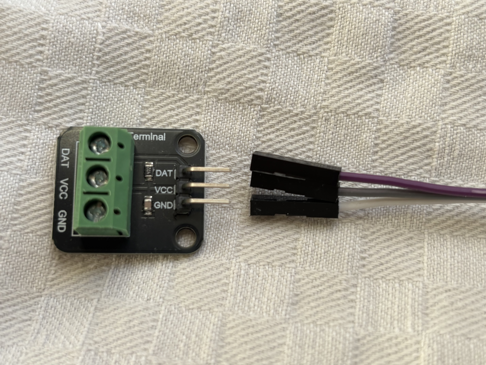
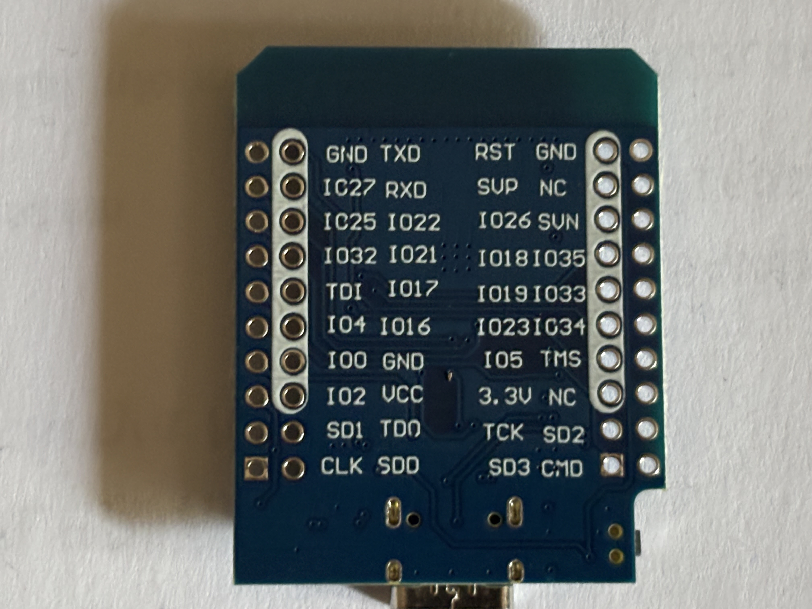

# ESP32 hőmérséklet-érzékelő

## ESP32 – DS18B20 – panel huzalozása

A DS18B20 hőmérő nem közvetlenül, hanem egy hárompólusú csavaros
csatlakozópanel közbeiktatásával kapcsolódik az ESP32-höz. A panelen található
`472` jelölésű, 4,7 kΩ-os ellenállás a DS18B20 adatvezetéke és a tápfeszültség
közötti szükséges felhúzóellenállás; külön ellenállást nem kell beépíteni.

Az összeszerelést az ESP32 USB-tápjának kihúzása után végezzük. A bekötésnél
elsődlegesen mindig a panel és az ESP32 feliratait kövessük, ne pusztán a
vezetékszíneket.

### DS18B20 és a csatlakozópanel

A panelt úgy tartva, hogy a zöld csavaros sorkapocs felül, a három csatlakozótüske
pedig alul legyen, a kapcsok és tüskék sorrendje balról jobbra:

```text
GND   VCC   DAT
```

| DS18B20 vezetéke | Funkció | Panel csavaros sorkapcsa |
|---|---|---|
| fekete | föld | `GND` |
| piros | tápfeszültség | `VCC` |
| sárga | 1-Wire adat | `DAT` |



A sodrott vezetékvégeket úgy rögzítsük, hogy kilógó elemi szál ne érhessen a
szomszédos kapocshoz. A csavarokat húzzuk meg, majd mindhárom vezetéket külön,
enyhén meghúzva ellenőrizzük.

### A csatlakozópanel és az ESP32

| Panel tüskéje | Jumper vezeték | ESP32 csatlakozója | Funkció |
|---|---|---|---|
| `GND` | tetszőleges szín | `GND` | közös föld |
| `VCC` | tetszőleges szín | `3.3V` | a DS18B20 tápellátása |
| `DAT` | tetszőleges szín | `IO16` / `GPIO16` | 1-Wire adat |

A panelhez adott jumperkábelek színe nem szabványos, csomagonként eltérhet. A
képen látható fehér–szürke–lila színkiosztás csak a lefényképezett példányra
érvényes. A panel `GND`, `VCC` és `DAT` jelölését kell konzisztensen végigvinni
az ESP32 megfelelő csatlakozójáig.





A firmware-ben a DS18B20 adatvonala `GPIO16`-ra van beállítva:

```cpp
constexpr uint8_t DS18B20_PIN = 16;
```

A szenzort **3,3 V-ról** tápláljuk. A panel `VCC` vezetékét ne kössük az ESP32
`5V` csatlakozójára. A `GND`, `VCC` vagy `DAT` felirat helye panelváltozatonként
eltérhet, ezért új panel bekötése előtt mindig olvassuk le a nyomtatott
jelöléseket.

### Bekapcsolás előtti ellenőrzés

1. A fekete DS18B20-vezeték a panel `GND` kapcsában van.
2. A piros DS18B20-vezeték a panel `VCC` kapcsában van.
3. A sárga DS18B20-vezeték a panel `DAT` kapcsában van.
4. A panel `GND` tüskéje az ESP32 `GND` csatlakozójára megy.
5. A panel `VCC` tüskéje az ESP32 `3.3V` csatlakozójára megy.
6. A panel `DAT` tüskéje az ESP32 `IO16` csatlakozójára megy.
7. Nincs kilógó vezetékszál, laza csavar vagy egymáshoz érő csatlakozó.

Az első bekapcsolás után a soros monitoron a `Sensor found at address:` üzenet,
majd a hőmérsékletértékek megjelenése igazolja a DS18B20 felismerését. A
`sensor_not_found` vagy `sensor_read_failed` hiba esetén először a táp-, föld-
és adatvezeték sorrendjét, majd a csavaros kötések szilárdságát ellenőrizzük.

## Új ESP32 első üzembe helyezése

Az új ESP32-n még nincs rajta az automation projekt firmware-e. Emiatt a soros
monitorban értelmezhetetlen karakterek jelenhetnek meg, és a `configure`
parancsnak nincs hatása. A Wi-Fi-konfigurálás előtt minden új ESP32-re külön fel
kell tölteni a firmware-t.

Egyszerre csak **egy új ESP32** legyen a Mac USB-portjára csatlakoztatva. A
panelek CP2102 USB–soros átalakítója azonos sorozatszámmal jelentkezhet be, ezért
több azonos panel egyidejű csatlakoztatása esetén a portok nem feltétlenül
különböztethetők meg megbízhatóan.

### 1. A soros port ellenőrzése

```sh
~/.platformio/penv/bin/pio device list
```

A jelenlegi panelek tipikusan ezen a porton jelennek meg:

```text
/dev/cu.usbserial-0001
```

Mindig a `pio device list` által ténylegesen kijelzett portot használjuk.

### 2. A firmware feltöltése

```sh
cd ~/Projects/automation/esp32/poc-ds18b20
~/.platformio/penv/bin/pio run \
  --target upload \
  --upload-port /dev/cu.usbserial-0001
```

A sikeres feltöltés végén a PlatformIO hard resetet végez. Ez normális és
szükséges: az ESP32 ekkor indul újra az imént feltöltött firmware-rel.

### 3. A soros monitor megnyitása

Csak a sikeres feltöltés és hard reset után indítsuk el a soros monitort:

```sh
~/.platformio/penv/bin/pio device monitor \
  --port /dev/cu.usbserial-0001 \
  --baud 115200
```

A saját firmware indulását az alábbi fejléc jelzi:

```text
ESP32 DS18B20 PoC
================
```

Ezután már használható a `configure` parancs. Ha továbbra is csak
értelmezhetetlen karakterek látszanak, ellenőrizzük, hogy a monitor 115200 baudon
fut-e, a megfelelő portot nyitottuk-e meg, és a feltöltés valóban sikeresen
befejeződött-e.

Az első ESP32 beállítása után zárjuk be a soros monitort `Ctrl+C`-vel, húzzuk ki
az eszközt, és csak ezután csatlakoztassuk a következőt. Ugyanezt a feltöltési és
konfigurálási folyamatot minden új ESP32-n külön végre kell hajtani.

## Wi-Fi konfigurálása USB-n keresztül

Az USB-kapcsolat firmware feltöltésére, első konfigurálásra és helyreállításra
szolgál. A normál mérési adatokat később kizárólag Wi-Fi-n keresztül olvassa az
alkalmazás.

Az ESP32 Wi-Fi interfészének MAC-címe:

```text
02:00:00:00:00:01
```

### 1. A soros konfiguráció megnyitása

A projekt könyvtárában indítsuk el a soros monitort:

```sh
cd ~/Projects/automation/esp32/poc-ds18b20
~/.platformio/penv/bin/pio device monitor \
  --port /dev/cu.usbserial-0001 \
  --baud 115200
```

A varázsló nem indul el automatikusan. A monitor megnyitása után írjuk be:

```text
configure
```

A PlatformIO soros monitor gépelés közben nem feltétlenül jeleníti meg a bevitt
karaktereket. A parancsot egyszer kell beírni, majd Entert nyomni.

A soros monitorból `Ctrl+C` billentyűvel lehet kilépni.

### 2. SSID és jelszó

A firmware minden esetben bekéri:

1. az eszköz egyedi hálózati nevét;
2. a 2,4 GHz-es Wi-Fi-hálózat SSID-jét;
3. a Wi-Fi-jelszót;
4. az IP-konfiguráció módját.

Az eszköznév egyben a DHCP felé bejelentett hostname, például `esp32-1`. A név
1-63 karakter hosszú lehet, és csak angol betűt, számot és kötőjelet
tartalmazhat. Kötőjellel nem kezdődhet és nem végződhet. A firmware kisbetűssé
alakítja és az NVS-tárhelyen megőrzi. A névnek a helyi hálózaton egyedinek kell
lennie.

A jelszónak 8-63 karakter hosszúnak kell lennie. A firmware a jelszót nem írja
vissza, és az összefoglalóban csak csillagok jelennek meg.

### 3. IP-konfiguráció kiválasztása

```text
IP mode: 1=DHCP, 2=DHCP reservation, 3=static
Selection:
```

#### 1 – Teljes DHCP

Az IP-címet, netmaskot, gatewayt és DNS-kiszolgálót teljes egészében a
DHCP-szerver adja. További hálózati adatot nem kell megadni.

#### 2 – DHCP-foglalás

A varázsló bekéri:

- a DHCP-szerveren lefoglalni kívánt IP-címet;
- a hálózat netmaskját;
- a gateway címét;
- opcionálisan az elvárt DNS-kiszolgálót.

Ezután megjeleníti a MAC-címet és a megadott hálózati adatokat. Ezek alapján a
felhasználó beállítja a címfoglalást a routeren vagy DHCP-szerveren. A firmware a
következő kérdésnél korlátlan ideig vár:

```text
Is the DHCP reservation configured? (yes/no):
```

A foglalás elkészítése után `yes` választ kell adni. Az ESP32 ebben a módban
technikailag továbbra is DHCP-kliens. Sikeres kapcsolódás után összehasonlítja a
DHCP-től kapott címet a kívánt címmel, és eltérés esetén figyelmeztet.

#### 3 – Teljesen statikus konfiguráció

A varázsló bekéri:

- a statikus IP-címet;
- a netmaskot;
- a gatewayt;
- az elsődleges DNS-kiszolgálót;
- opcionálisan a másodlagos DNS-kiszolgálót.

A firmware ellenőrzi az IPv4-címeket, a netmask folytonosságát, az alhálózatot,
valamint azt, hogy a saját cím nem hálózati cím, broadcast cím vagy a gateway
címe-e.

### 4. Ellenőrzés és mentés

A varázsló a jelszó kivételével visszaírja a beállításokat, majd megkérdezi:

```text
Save and connect? (yes/no):
```

- `yes`: mentés az ESP32 tartós NVS-tárhelyére és kapcsolódási próba;
- `no`: a konfigurációs folyamat újrakezdése;
- `cancel`: kilépés mentés nélkül.

Sikeres kapcsolódáskor megjelenik a tényleges IP-cím, netmask, gateway, DNS és
jelerősség.

### 5. Sikertelen kapcsolódás

Egy kapcsolódási kísérlet legfeljebb 15 másodpercig tart. Sikertelenség esetén
az ESP32 nem blokkolja a szenzormérést, hanem az alábbi késleltetésekkel próbál
újra kapcsolódni:

```text
5 másodperc, 15 másodperc, 30 másodperc, 1 perc, 2 perc,
majd 5 percenként
```

Három egymást követő sikertelen kapcsolódási kísérlet után a firmware
újrainicializálja a Wi-Fi-rádiót. Ha a kapcsolat 30 percen keresztül nem áll
helyre, az ESP32 kontrolláltan újraindul, majd a tartós NVS-tárhelyen megőrzött
konfigurációval folytatja a kapcsolódást. A folyamat nem törli az SSID-t,
jelszót, eszköznevet vagy IP-beállításokat.

A szenzormérés konfigurálás és kapcsolódási próba közben is folytatódik, de a
hőmérsékleti sorok ilyenkor nem jelennek meg a soros monitoron, így nem zavarják
a kérdéseket.

Új hálózati adatok megadásához USB-n keresztül bármikor használható a
`configure` parancs.

### 6. Karbantartási parancsok

```text
status
```

Kiírja a MAC-címet, a kapcsolat állapotát, a mentett konfigurációt maszkolt
jelszóval, valamint kapcsolat esetén a tényleges hálózati adatokat.

```text
configure
```

Elindítja az újrakonfigurálást. A korábbi beállítás addig megmarad, amíg az új
beállítást a felhasználó jóvá nem hagyja.

```text
forget
```

Törli a mentett Wi-Fi-konfigurációt, bontja a kapcsolatot és elindítja a
konfigurációs varázslót.

```text
cancel
```

Megszakítja az aktív varázslót. Korábbi mentett konfiguráció esetén az nem
törlődik.

## A jelenlegi hardveres próba

1. Csatlakoztassuk az ESP32-t USB-n.
2. Indítsuk el a soros monitort.
3. Írjuk be a `configure` parancsot.
4. Adjuk meg az egyedi eszköznevet, például `esp32-1`.
5. Adjuk meg a valódi 2,4 GHz-es SSID-t és jelszót.
6. Válasszuk ki az IP-módot.
7. DHCP-foglalás esetén állítsuk be a routeren a foglalást a
   az eszköz kijelzett MAC-címéhez, majd válaszoljunk `yes`-szel.
8. Ellenőrizzük az összefoglalót, majd válaszoljunk `yes`-szel a mentésre.
9. Sikeres kapcsolódás után jegyezzük fel a kijelzett IP-címet.
10. A `status` paranccsal ellenőrizzük újra a kapcsolatot és a nevet.

## Mérési adatok olvasása Wi-Fi-n

A normál adatkiolvasás HTTP-n, JSON formátumban történik. Az USB-kimenet nem
része az alkalmazás adatgyűjtési folyamatának.

### Állapot

```sh
curl --fail --show-error http://esp32-1/api/v1/health
```

A végpont az eszköz elérhetőségét, uptime-ját, Wi-Fi-jelerősségét és a szenzor
állapotát adja vissza.

### Eszközadatok

```sh
curl --fail --show-error http://esp32-1/api/v1/device
```

A válasz tartalmazza az eszköznevet, MAC- és IP-címet, firmware-verziót,
uptime-ot és RSSI-t.

### Mérés

```sh
curl --fail --show-error http://esp32-1/api/v1/measurements
```

Példaválasz:

```json
{
  "schema_version": 1,
  "device_id": "esp32-1",
  "readings": [
    {
      "sensor_id": "28FFFFFFFFFFFFFF",
      "sensor_type": "temperature",
      "unit": "celsius",
      "value": 28.625,
      "quality": "good",
      "error_code": null,
      "age_ms": 412,
      "available": true
    }
  ]
}
```

Leválasztott vagy hibás szenzor esetén a HTTP-kérés továbbra is sikeres, de a
`value` értéke `null`, a `quality` értéke `invalid`, és az `error_code` leírja a
hibát. Így az alkalmazás a hibás mérést is szabályosan rögzítheti, miközben a
pollingkört folytatja.

Az ESP32 nem készít abszolút mérési időbélyeget. Az alkalmazás a HTTP-lekérés
időpontját írja az adatbázis `observed_at` mezőjébe; az `age_ms` megmutatja,
hány milliszekundummal korábban készült az ESP32 legutóbbi érvényes mérése.
